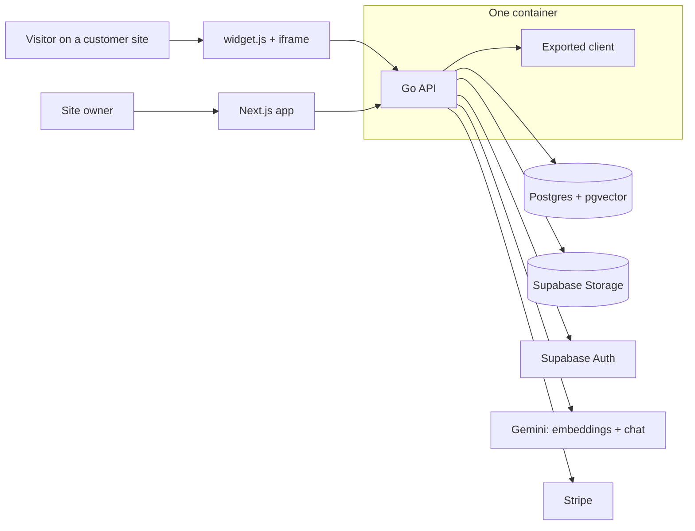

# hovr

A chat on your site that actually knows your business. Upload your documents, and hovr
answers visitors in a chat bubble, with a link to where each answer came from.

- **Knowledge:** PDF, Word, Markdown and text files, or pasted text, processed in the
  background into searchable pieces.
- **Answers:** streamed, in the visitor's language, with source chips. When the documents
  don't cover a question, the bot says so instead of inventing an answer.
- **Widget:** one script tag on any site, with your colour, greeting and logo.
- **Inbox:** every question the bot couldn't answer, with "Teach your bot" to fix it in one step.
- **Billing:** Stripe Checkout, customer portal and plan limits enforced on the server.

## How it works



Answering a question:

```mermaid
sequenceDiagram
    participant V as Visitor
    participant S as Server
    participant D as Postgres
    participant G as Gemini
    V->>S: question
    S->>G: embed the question
    S->>D: nearest chunks of this bot (cosine, HNSW)
    alt best match below the threshold
        S->>G: answer with no knowledge (small talk, or "I can only help with X")
    else
        S->>G: answer using only these passages, cite them
    end
    G-->>S: streamed answer
    S-->>V: text chunks, then the saved message with citations
    S->>D: save the message; unanswered widget questions go to the inbox
```

## Run it locally

Needs Docker, Go 1.26, Node 22 with pnpm, the Supabase CLI and a Gemini API key.

```bash
make db-start                 # local Supabase (Postgres, Auth, Storage, Mailpit)
cp server/.env.example server/.env   # then fill it in, see below
make server                   # API on :8080
make client-install && make client   # app on :3000, proxies /api to :8080
```

`server/.env` needs the local Supabase keys from `make db-status`, a Gemini key, and the
Stripe test keys. Stripe price ids come from two monthly products (Pro and Business) in
your test account; the webhook secret from
`stripe listen --forward-to localhost:8080/api/billing/webhook`.

Sign-up emails land in Mailpit at http://127.0.0.1:54324, and the database browser is at
http://127.0.0.1:54323.

To run it the way it is deployed, as one container serving the API and the built client:

```bash
docker compose up --build     # http://localhost:8080
```

## Commands

| Command | What it does |
| --- | --- |
| `make db-start` / `make db-stop` / `make db-reset` | local Supabase |
| `make server` | Go API on :8080 |
| `make client` / `make client-build` | Next dev server / static export |
| `make test` | Go tests against the local database |
| `make vet` / `make client-lint` | Go vet / ESLint and TypeScript |

## Tests

`make test` runs everything, including tests against the local Supabase database, with a
fake embedder so nothing calls Gemini and no API key is needed. Two tests talk to the real
Gemini API and only run when asked:

```bash
HOVR_CALIBRATE=1 go test ./internal/rag -run Calibrate -v   # similarity scores per question
HOVR_EVAL=1 make test                                       # real answers for a sample knowledge base
```

CI (GitHub Actions) runs gofmt, vet and the Go tests with `-race` against a Postgres started
by the Supabase CLI, lints and builds the client, and builds the Docker image.

## Layout

```
server/     Go: API, ingestion, retrieval, chat, widget, billing; serves the client build
client/     Next.js: landing, app, widget loader and iframe page (static export)
supabase/   migrations and local stack config
```

Inside `server/`: `internal/` holds the product code (`auth`, `bots`, `sources`, `rag`,
`chat`, `widget`, `inbox`, `overview`, `billing`), `pkg/` the generic helpers, and `test/`
everything only tests use, including `.http` files for trying the API by hand.

## Decisions worth knowing

- **One container.** The Go server serves the API and the exported client, so there is one
  deploy, one URL, and no CORS or cookie problems.
- **Sessions in httpOnly cookies.** The browser never holds a token: the Go server talks to
  Supabase Auth and sets cookies, refreshes them silently, and checks the Origin header on
  every write.
- **Answers are grounded.** Retrieval only sees the asking bot's own ready sources. Below a
  similarity threshold calibrated on real scores, the model gets no passages at all, and the
  prompt makes it say "I don't know" when the passages don't cover the question. That flag,
  not the score, is what fills the inbox.
- **Model choice is a config change.** Embeddings and chat sit behind small interfaces, and
  chat falls back to the next model when one is overloaded, which the free tier often is.
- **The database rejects bad writes.** Stores don't check first; they write and translate
  the database error into a readable message.
