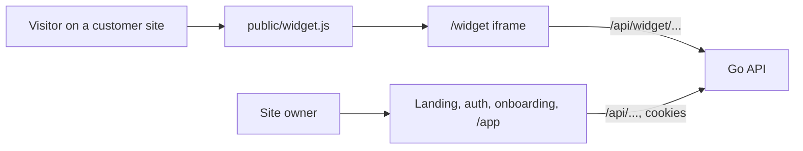

# Architecture

The client is a Next.js 16 app built as a static export (`output: "export"`). There is no
Node server in production: the Go server serves the files from `client/out` and answers
`/api`. In development `next dev` runs on :3000 and proxies `/api` to :8080
(`next.config.ts`), so the browser always calls the API on its own origin.

## Routes

| Route | What it is |
| --- | --- |
| `/` | landing: hero, setup steps, features, pricing, FAQ; also loads our own bot through `widget.js` |
| `/signup`, `/signin`, `/forgot-password`, `/reset-password` | auth forms; sign-in and sign-up send someone already signed in on to `/app` |
| `/onboarding` | the first bot: a name plus files or pasted text; `?new=1` adds another bot |
| `/app` | Welcome steps until the widget has been seen on a site, then the Overview |
| `/app/playground`, `/knowledge`, `/inbox`, `/widget`, `/billing` | the app screens |
| `/widget?key=pub_...` | the chat inside the iframe that `widget.js` adds to a customer's page |
| `/opengraph-image` | the link preview, drawn at build time |

App screens work on one bot, kept in `?bot=<id>` so a link opens the same bot. Without it the
shell falls back to the last bot used (`localStorage` `hovr-bot`), then the first one.
Inbox and Widget also keep their tab in the address (`?tab=`, `?item=`), so reloads and
shared links land in the same place.

## Folders

| Folder | What it owns |
| --- | --- |
| `app/` | routes only: metadata and one screen component each |
| `components/app` | the shell, sidebar, app context, page header, Welcome steps, load errors, `PlanError` (an error with "See plans" on a plan limit) |
| `components/landing` | landing sections |
| `components/auth`, `onboarding` | sign-in and sign-up forms, first bot setup |
| `components/overview`, `playground`, `knowledge`, `inbox`, `billing`, `widget-editor` | one folder per app screen |
| `components/widget` | the live chat in the iframe and its email form |
| `components/widget-panel.tsx`, `widget-preview.tsx` | the drawn widget used by the landing, Welcome and the widget editor |
| `components/chat-text.tsx` | `AnswerText` (answers with `[n]` as small numbers) and the typing `Caret`, used by the Playground, Inbox and widget |
| `components/ui` | shared primitives: button, dropdown menu, the `Segmented` pill switch, skeleton |
| `lib/` | API calls per feature, shared types, formatting, colours, theme, and the shared hooks below |
| `public/widget.js` | the loader customers paste on their site |
| `test/` | Vitest tests and their helpers; see [development.md](development.md) |

## Talking to the API

`lib/api.ts` is the one place that calls `fetch`. `api<T>(path, options)` sends JSON or
`FormData` to `/api<path>` with the session cookies, and turns any failure into an
`ApiError` carrying the server's `error` message and `code`:

- `err.message` is shown to the user as it is: the server writes it for people.
- `err.upgradeRequired` (402, `upgrade_required`) shows a "See plans" link next to the message.
- A network failure becomes `ApiError(0, "Can’t reach hovr right now…")`.
- `errorMessage(err)` gives a safe text for anything else.

Each feature has its own file with typed calls: `bots.ts`, `sources.ts`, `chat.ts`,
`inbox.ts`, `billing.ts`, `widget.ts`. Answers stream as server-sent events over a POST,
which `EventSource` can't do, so `lib/sse.ts` reads the response body and `streamChat`
turns the events into callbacks: `conversation`, `text`, then `done` with the saved message.

## Sessions

The session lives in httpOnly cookies that the server sets and refreshes; the client never
sees a token. `AppShell` loads `/me`, `/bots` and `/billing` once and shares them through
`useApp()`. A 401, or a 404 for an account that no longer exists, means signed out and goes
to `/signin` (`isSignedOut` in `lib/session.ts`). An account with no bots goes to
`/onboarding`. Other failures show "Try again" instead of a blank page.

`useApp()` also gives `href(path)` for links that keep the selected bot, `reload()` after a
change that affects the sidebar or plan, and `updateBot(bot)` to swap in a saved bot
without reloading.

Shared hooks and helpers in `lib/`:

- `useKeyed(key, load)` loads what's on screen again when `key` changes, and treats a result
  for an older key as still loading.
- `useSetQuery()` changes `?tab=` / `?item=` in place.
- `readLocal` / `writeLocal` wrap `localStorage`, so blocked storage never throws.

## Styling

Tailwind 4 with the design tokens in `app/globals.css`: colours are CSS variables
(`--page`, `--surface`, `--ink`, `--subtle`, `--line`, status colours) with a `.dark` set.
The theme script in `app/layout.tsx` runs before paint: a saved choice (`hovr-theme`) wins,
otherwise the system setting, so there is no flash of the wrong theme.

Motion is a few keyframes in `globals.css` (`rise`, `grow-up`, `grow-right`, `ring`,
`caret`) plus `tw-animate-css` for enter and exit. They use `backwards` fill, so nothing
stays transformed after the animation ends, and `prefers-reduced-motion` turns them off.
