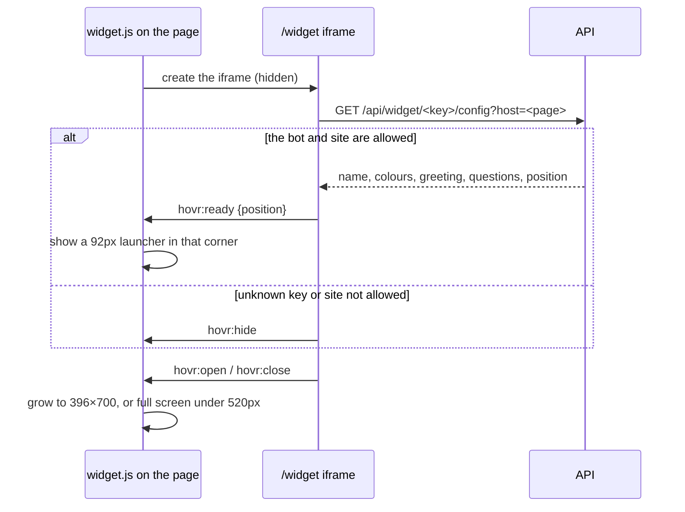

# Widget

What a customer pastes on their site:

```html
<script src="https://<hovr address>/widget.js" data-bot="pub_..." defer></script>
```

## Loader and iframe

`public/widget.js` is plain ES5 with no dependencies, so it runs on any site. It adds one
fixed iframe pointing at `/widget?key=<public key>` on hovr's own origin and does nothing
else: the chat, its styles and its storage all live inside the iframe, away from the host
page's CSS and scripts.

The iframe starts hidden and the two sides talk through `postMessage`. The loader only
accepts messages from its own iframe and hovr's origin.



The config loads before anything shows, so the launcher never appears in the wrong colours
and a refused site shows nothing. On close, the panel plays its exit animation first
(`CLOSE_MS`) and only then asks the loader to shrink the iframe.

## Chat inside the iframe

`components/widget/chat-widget.tsx`:

- **Host.** Every call sends the page's address (`document.referrer`) so the server can
  check it against the bot's allowed websites.
- **Visitor.** A random `hovr:visitor` id identifies the visitor. The open conversation is
  kept as `hovr:conv:<key>`, so a reload or the next page brings it back through
  `/conversations/<id>`.
- **Storage.** `remember` / `recall` in `lib/widget.ts` write to the iframe's
  `localStorage`, with a copy in memory for browsers that block third-party storage. Then
  the chat lasts one page view.
- **Answers** stream in with a blinking caret; the finished answer replaces the streamed
  bubble without animating in again.
- **Sources.** The server sends widget answers without citations or `[n]` markers, so the
  visitor sees only the answer. The owner still sees both in the Playground and the Inbox.
- **Email.** Under the first answer the bot didn't know (`answered: false`), the visitor can
  leave an email once per conversation (`hovr:lead:<conversation>`). It stays under that
  answer as the chat goes on.
- **Errors** shown to visitors are generic: a 402 (the owner's plan ran out) becomes "can't
  take new questions right now", never the owner-facing message.
- **Escape** closes the panel.

## Colours

A bot has a main `color` and three chat colours: `chatBackground`, `visitorMessageColor`
and `botMessageColor`. `lib/chat-colors.ts` turns them into styles, the same way for the live
widget and the drawn previews:

| Function | What it does |
| --- | --- |
| `chatColors(bot)` | fills in the defaults (`#FFFFFF` background, `#F0F0EE` bot messages) if the server sent none |
| `chatPalette(background)` | the panel's `--w-*` variables from the background: text, muted text, soft fills, borders, shadow |
| `visitorBubble(color, visitorMessageColor)` | the visitor's bubble; `null` means the main colour |
| `botBubble(botMessageColor)` | the bot's bubble |

Text colour on any fill comes from `onColor` in `lib/format.ts`, so it stays readable on
light and dark choices alike.

## Previews

`WidgetPanel` in `components/widget-panel.tsx` is a drawn copy of the live widget: the same
header, first screen, bubbles, composer and "Powered by" badge, with the same sizes (a
380×684 panel). It never talks to the API. `WidgetPreview` wraps it with the launcher, so
the preview opens and closes like the real one.

They are used on:

- **the landing hero**: a sample chat;
- **Welcome**: the bot as visitors will see it;
- **the widget editor**: the unsaved settings, on a made-up site whose colour the owner
  picks. That colour is only for the preview and is kept in `localStorage`
  `hovr-preview-site`, never on the bot.

When the live widget changes its look, change the drawn one with it, or the previews stop
matching what visitors get.
