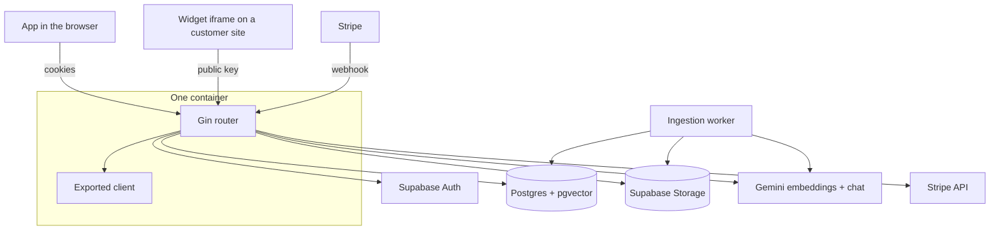

# Architecture

The Go server is the whole backend: it serves the API, the exported Next.js client and the
widget, and talks to Supabase (Postgres, Auth, Storage), Gemini and Stripe.

## Packages

| Package | What it owns |
| --- | --- |
| `cmd` | startup: config, database pool, services, worker, graceful shutdown |
| `internal/config` | environment values, `.env` in development, required-value check |
| `internal/db` | pgx pool, pgvector types, `search_path` |
| `internal/router` | routes, `/healthz`, serving the client export |
| `internal/auth` | token verification (own JWKS code), session cookies, `/api/auth/*` |
| `internal/supabase` | Supabase Auth REST client |
| `internal/accounts` | account and plan lookup, `/api/me` |
| `internal/plans` | what each plan allows |
| `internal/bots` | bot settings, public key, avatars, plan limits; `Access` is the shared "is this bot yours?" lookup every feature uses |
| `internal/sources` | upload, extraction, chunking, the background worker |
| `internal/storage` | Supabase Storage REST client |
| `internal/ai` | Gemini embeddings and chat models behind interfaces |
| `internal/rag` | retrieval, relevance threshold, prompt, streamed answers |
| `internal/chat` | conversations, messages, SSE responses, usage, inbox rows |
| `internal/widget` | public widget API, domain check, rate limits |
| `internal/inbox` | unanswered questions, "Teach your bot", leads |
| `internal/overview` | dashboard numbers |
| `internal/billing` | Stripe checkout, portal, webhook, plan sync |
| `internal/usage` | the monthly message counter: count, refund, read |
| `pkg/apperr`, `pkg/httpx`, `pkg/validate`, `pkg/ratelimit` | generic helpers |
| `test/` | test-only: `testdb`, `testapi`, `fakeai`, `fakestorage`, `.http` requests |

`internal/` is product code, `pkg/` is code that would work in another project, and `test/`
is imported only by tests.

## Request flow

Everything under `/api` checks the Origin header on writes. Signed-in routes then run
`auth.RequireUser`, which reads the access cookie and silently refreshes it when expired.
Two routes are deliberately outside that: the widget API (public, identified by the bot's
public key) and the Stripe webhook (another server, proven by its signature).

Handlers stay thin: read input, call a store or service, and answer with `httpx.Write`,
which turns an `*apperr.Error` into its status and message and anything else into a logged
500.

## Ingestion

Uploads go to Storage first, then a `queued` source row is inserted, which also enforces
the plan's source limit. The worker claims jobs with `for update skip locked`, extracts the
text (PDF, DOCX, Markdown, plain text), splits it along paragraphs and sentences into
roughly 900-character chunks with one sentence of overlap, embeds them in batches of 100,
and writes them with `COPY`. Failures are stored as a readable reason on the source.
Sources stuck in `processing` after a crash are requeued at startup.

## Answering

1. Embed the question and search the asking bot's `ready` chunks by cosine distance.
   The HNSW index is shared by every bot, so the search runs with
   `hnsw.iterative_scan = relaxed_order` and is sorted again afterwards.
2. If the best score is below `rag.MinScore`, the model gets no passages: greetings,
   thanks and off-topic questions are handled by the prompt instead.
3. The prompt allows only facts from the numbered passages, asks for `[n]` citations and
   for the visitor's language, and requires a `[no-answer]` marker when the passages don't
   cover the question. The marker is stripped from the stream and stored as
   `answered = false`.
4. Answers stream as server-sent events: `conversation`, `text`, then `done` or `error`.
5. Widget messages count against the monthly limit (playground chats are free), and
   unanswered widget questions become inbox items.

The threshold was calibrated on real scores: covered questions scored 0.62–0.76 and
off-topic ones 0.51–0.56, while questions that are on topic but not covered overlap the
covered range. So the score only filters off-topic questions, and the model decides the
rest.

## Failure handling

- Chat models fall back to the next model when one fails or sends nothing within 12
  seconds, which the free tier often does.
- A failed answer refunds the counted message.
- An answer is saved even if the visitor closes the page mid-stream.
- Stores don't check before writing: `apperr.Map` translates database errors (missing row,
  duplicate, bad value) into readable messages.
- Deleting a bot also deletes its stored files and avatar.

## Known duplication

Question grouping exists twice: `chat.normalizeQuestion` in Go for inbox items, and the
same rules as SQL in the overview's top-questions query. Unifying them means storing the
normalized text on messages, which is a migration; until then, change both together.
