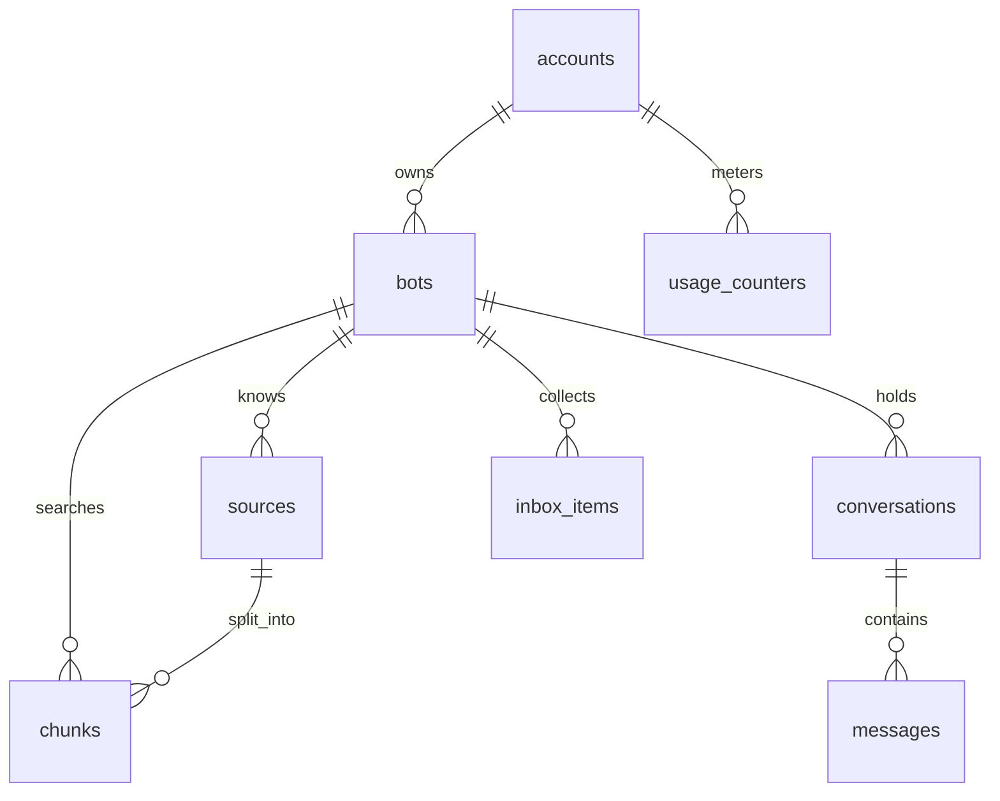

# Database

Supabase Postgres with pgvector. One migration, `supabase/migrations/*_init.sql`, holds the
whole schema; `make db-reset` rebuilds a local database from it.

Only the Go server touches these tables. It connects as the database owner and scopes every
query to the signed-in account. Row level security is enabled with no policies, so the
public Data API (the `anon` and `authenticated` roles) can read and write nothing.

## Tables

**accounts** — one per `auth.users` row, created by the `handle_new_user` trigger on
sign-up. Holds `plan` (`free`, `pro`, `business`), `stripe_customer_id`,
`stripe_subscription_id` and `current_period_end`.

**bots** — `account_id`, `name`, `public_key` (unique, used by the widget),
`allowed_domains`, and the widget's look: `color`, `avatar_url`, `position`, `greeting`,
`suggested_questions`, `show_badge`, `chat_background` and `bot_message_color`. The last
two are hex colours with defaults; `visitor_message_color` is the one that may be null,
meaning the visitor's messages follow `color`. `last_seen_host` and `last_seen_at` record
where the widget was last opened.

**sources** — a piece of knowledge: `type` (`file`, `text`, `inbox`), `title`,
`storage_path`, `content_type`, `size_bytes`, `pages`, `status`
(`queued → processing → ready | failed`), `error` and `processed_at`. A partial index on
pending rows is what the worker polls.

**chunks** — `source_id`, `bot_id`, `chunk_index`, `content` and `embedding vector(768)`,
with an HNSW index using cosine distance. `bot_id` is repeated here so search filters
without a join.

**conversations** — `bot_id`, `channel` (`playground`, `widget`), `visitor_id` (the widget's
anonymous browser id, null for playground), `visitor_email` (a lead), `title` and
`last_message_at`. One index orders a bot's conversations, another finds leads.

**messages** — `conversation_id`, `role`, `content`, `citations` (JSON: source id, title,
score) and `answered`, which is set on assistant messages only and is what the inbox and
the dashboard count.

**inbox_items** — questions the bot couldn't answer on the widget, unique per
`(bot_id, normalized)` so repeats raise `times_asked` instead of adding rows. Holds
`status` (`open`, `done`), `last_conversation_id`, `answer_source_id` and `last_asked_at`.

**usage_counters** — `(account_id, period)` with `period` as `YYYY-MM` in UTC, and the
month's `messages`.

## Things worth knowing

- **Cascades.** Deleting an auth user removes the account and everything under it. Files in
  Storage are not covered by cascades, so the bot and source handlers delete them
  explicitly.
- **The message limit is one statement**, in `internal/usage`. The insert has
  `on conflict do update ... where messages < limit` and returns nothing when the limit is
  reached, so two parallel requests can't both slip past it.
- **Plan limits for bots and sources** are checked inside a transaction that locks the
  account row, for the same reason.
- **Embeddings are 768 dimensions**, matching `gemini-embedding-001` with
  `outputDimensionality = 768`. Changing the model means changing the column and
  reprocessing every source: vectors from different models can't be compared.
- **Retention.** Free accounts see only the last 7 days of inbox items and leads; the rows
  stay in the database.
